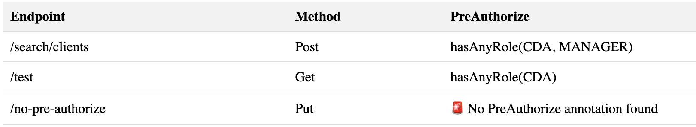

# SPRING ACCESS INSPECTOR

This project is composed of two parts:

- The inspector itself.
- The wrapper plugin that allows to easily use spring-access_inspector on any project.

## Inspector itself

This project uses java 21

### What is spring-access-control ?

This tool creates a table report to verify access control on Spring Boot routes.
It uses the [`Preauthorize`, `Secured` or `RolesAllowed`](https://www.baeldung.com/spring-security-method-security) annotation from `spring-security-config`.
It creates a table.html file with a list of your routes and their preauthorize.



### How to use it

If you want to directly use the inspector without the plugin, follow those steps:

- Clone the repository:

`git clone git@github.com:theodo-group/spring-access-inspector.git`

- Go inside the inspector folder:

`cd spring-access-inspector/inspector`

- Compile the code:

`mvn compile exec:java -Dexec.mainClass=com.theodo.inspector.SpringAccessInspector`

- Run the code (using maven exec plugin) and give it the path of the pom you want to analyze :

`mvn exec:java -Dexec.mainClass=com.theodo.inspector.SpringAccessInspector -Dexec.args="/the_path/where/poms/are"`

N.B: You may need to compile your code before:

`mvn clean install -DskipTests`

## The maven plugin

The plugin allows to easily launch the inspector by adding a plugin in the pom.xml of the project you want to inspect.

- First compile the plugin

`mvn clean install`

- In your `./your_project/pom.xml` file, add the plugin in `build/pluginManagement` as follows:

```xml
  <build>

    ... Whatever...

    <pluginManagement>
        <plugins>
            <plugin>
                <groupId>com.theodo</groupId>
                <artifactId>inspector-maven-plugin</artifactId>
                <version>1.0.0</version>
                <configuration>
                    <projectBaseDir>${project.basedir}</projectBaseDir>
                    <htmlOutputFile>./table.html</htmlOutputFile>
                </configuration>
            </plugin>
      </plugins>
    </pluginManagement>
  </build>
```

- Then in your Shell or CI, launch the analysis:

`mvn inspector:inspect`
