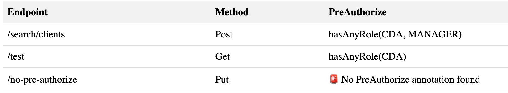

## Requirements

This project uses java 17

## What is spring-access-control ?

This tool creates a table report to verify access control on Spring Boot routes.
It uses the [`Preauthorize`, `Secured` or `RolesAllowed`](https://www.baeldung.com/spring-security-method-security) annotation from `spring-security-config`

It creates a table.html file with a list of your routes and their preauthorize.

## How to use it

Clone the repository:
`git clone git@github.com:marine-mb/spring-access-inspector.git`

Go inside the repo:
`cd spring-access-inspector`

Compile the code:

`mvn compile exec:java -Dexec.mainClass=com.theodo.inspector.PreAuthorizeAnalysis`

Run the code (using maven exec plugin) and give it your pom path:

`mvn exec:java -Dexec.mainClass=com.theodo.inspector.PreAuthorizeAnalysis  -Dexec.args="/the_path/where/poms/are"`

N.B: Compile your code before:

`mvn clean install -DskipTests`
